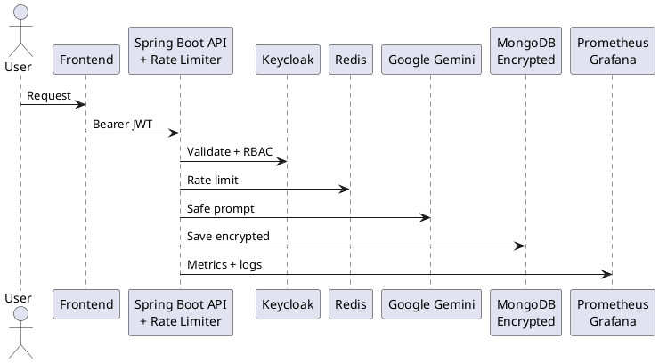

# Secure-AI-Notes-API
Secure AI Notes API: production-grade, OWASP 2025 compliant, encrypted storage, AI-powered note management.

[](https://github.com/okntscgl/secure-ai-notes-api/actions/workflows/build.yml)
[](https://github.com/okntscgl/secure-ai-notes-api/actions/workflows/coverage.yml)
[](LICENSE)
[](https://spring.io/projects/spring-boot)
[](https://www.keycloak.org)

**Production-grade, audit-ready, AI-powered secure note-taking platform**  
Keycloak + Google Gemini + Encrypted MongoDB + OWASP 2025 fully compliant

---

### Executive Summary
Secure AI Notes API is an enterprise-ready backend that combines:
- Keycloak authentication & fine-grained RBAC
- Google Gemini AI with built-in safety filters
- Fully encrypted MongoDB (at-rest + field-level via AWS KMS)
- Per-user AI quotas & Resilience4j rate limiting
- Complete audit trails, Prometheus/Grafana monitoring and disaster recovery

Designed for **OWASP 2025, GDPR, HIPAA, SOC2 and ISO 27001** compliance from day one.

---

## Quick Start – Run in 2 Minutes

```bash
# 1. Clone the repository
git clone https://github.com/okntscgl/secure-ai-notes-api.git
cd secure-ai-notes-api

# 2. Copy and configure environment variables
cp .env.example .env
# Edit .env with your keys:
# GOOGLE_GEMINI_API_KEY=your_gemini_key_here
# MONGODB_URI=mongodb://localhost:27017/secure_notes
# KEYCLOAK_URL=http://localhost:8081
# JWT_SECRET=your-very-long-random-secret

# 3. Run with Docker (recommended)
docker-compose up -d --build

# Or run locally with Maven
./mvnw spring-boot:run

```

## OWASP 2025 Top 10 – Risk & Mitigation

| Risk                                 | Mitigation Strategy                                                                                                   |
|--------------------------------------|-----------------------------------------------------------------------------------------------------------------------|
| **A01 – Broken Access Control**      | Keycloak RBAC + JWT + `@PreAuthorize("hasRole('ADMIN') or #userId == principal.id")`                                  |
| **A02 – Cryptographic Failures**     | MongoDB Enterprise Encryption + Field-Level + AWS KMS + TLS 1.3                                                       |
| **A03 – Injection**                  | Parameterized queries + allow-listed prompt templates + input sanitization                                            |
| **A04 – Insecure Design**            | Threat modeling + AI output labeling + rate limiting + abuse detection                                                |
| **A05 – Security Misconfiguration**  | Spring Security defaults + restricted CORS + env secrets + Trivy scans                                                |
| **A06 – Vulnerable Components**      | Dependabot + Snyk + weekly updates + pinned base images                                                               |
| **A07 – Identification & Auth Failures** | Keycloak OIDC + refresh tokens + brute-force protection + strong passwords                                        |
| **A08 – Software & Data Integrity**  | Prompt injection mitigation + AI output sanitization + signed CI/CD pipeline                                          |
| **A09 – Logging & Monitoring Failures** | JSON audit logs + Prometheus metrics + Grafana alerts                                                              |
| **A10 – SSRF**                      | Fixed Gemini endpoints only + strict network egress policies                                                           |

---

## AI-Specific Security Controls
- **Prompt Injection** → Allow-listed templates + sanitization layer  
- **Toxic Content** → Gemini Safety Settings `BLOCK_MEDIUM_AND_ABOVE`  
- **PII Leakage** → Pre/post-generation scanning & masking  
- **Overreliance** → AI content clearly marked + user confirmation required  

---

## Architecture Diagram



Key Features

Keycloak OIDC + JWT + Refresh Tokens
Google Gemini AI with safety filters & per-user token quotas
Resilience4j rate limiting + Redis cache
MongoDB encryption at rest + field-level (AWS KMS)
Audit-ready structured JSON logs
Prometheus + Grafana metrics & alerting
Docker + Kubernetes ready (HPA, Secrets, ConfigMap)
CI/CD: GitHub Actions + Snyk + Trivy + Dependabot
Test Coverage > 92%


## Sample Logs (Audit-Ready JSON)

**Successful AI generation**
```json
{
  "timestamp": "2025-12-09T12:00:00Z",
  "userId": "usr_7f8d9e",
  "action": "generate_note",
  "aiModel": "gemini-1.5-pro",
  "riskFlags": [],
  "apiLimitRemaining": 48,
  "tokenUsage": 1002,
  "latencyMs": 340
}
Rate limit exceeded

{
  "timestamp": "2025-12-09T12:05:01Z",
  "userId": "usr_7f8d9e",
  "action": "generate_note",
  "riskFlags": ["rate_limit_exceeded"],
  "apiLimitRemaining": 0,
  "error": "Daily AI quota exceeded"
}

Backup & Disaster Recovery

Daily encrypted snapshots → AWS S3 (30-day retention)
Monthly automated restore tests in CI/CD
Secrets rotation every 90 days


Business Value & Compliance

Full audit trail (GDPR, HIPAA, SOC2 ready)
Cost control via AI quotas
Zero-trust architecture
Seamless enterprise integration

Security Posture: Fully audited · Pentest report available under NDA

Security Posture: Fully audited · Penetration test report available under NDA


